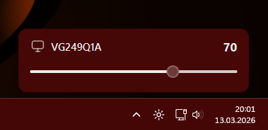
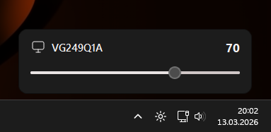
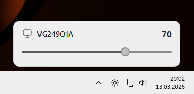

<p align="center">
  
</p>

# Brightness Slider For Desktop

A lightweight desktop brightness controller for **Windows desktop systems** that adjusts monitor brightness directly from the **taskbar tray** using **DDC/CI**.

The goal of this project is simple: provide a clean and responsive brightness control tool **without adding noticeable CPU or RAM overhead to the system**.

Unlike many similar tools that run with **5+ background processes**, this application is designed to work as a **single lightweight process** while still offering:

- Real-time brightness control
- DDC/CI-based monitor synchronization
- Multi-monitor support
- Theme-aware UI
- A dynamic popup inspired by the **native laptop brightness menu**
- Portable usage with **no installer required**

---

# Why this app?

Most existing desktop brightness tools either:

- run multiple background processes
- feel unnecessarily heavy for such a simple task
- have complex or outdated interfaces
- or do not integrate well with Windows UI

**Brightness Slider For Desktop** was created to solve that.

It is a tray-based brightness utility designed to be:

- lightweight  
- visually native to Windows  
- responsive  
- simple to use  

The UI dynamically adapts to Windows theme settings and behaves similarly to the brightness popup found on laptop systems.

---

# Screenshots

### Theme accent adaptive appearance


### Dark mode adaptive appearance


### Light mode adaptive appearance


---

# Features

- Taskbar tray brightness control
- Single-process lightweight architecture
- DDC/CI brightness control
- Multi-monitor support
- Dynamic popup UI
- Windows theme-aware design
- Light / dark mode adaptive tray icon
- Launch at startup option
- Portable usage
- No installation required

---

# How it works

The application communicates with compatible monitors through **DDC/CI** and updates brightness in sync with the monitor hardware.

When the tray popup is opened:

- detected monitors are listed automatically
- each supported display gets its own brightness slider
- brightness updates are applied in real time
- the UI adapts to Windows theme and accent settings

The popup is designed to be compact and fast, allowing brightness adjustment directly from the taskbar.

---

# Building from Source

## Requirements

Make sure the following Python packages are installed in your environment:

```bash
pip install PySide6 screen_brightness_control pyinstaller
```
