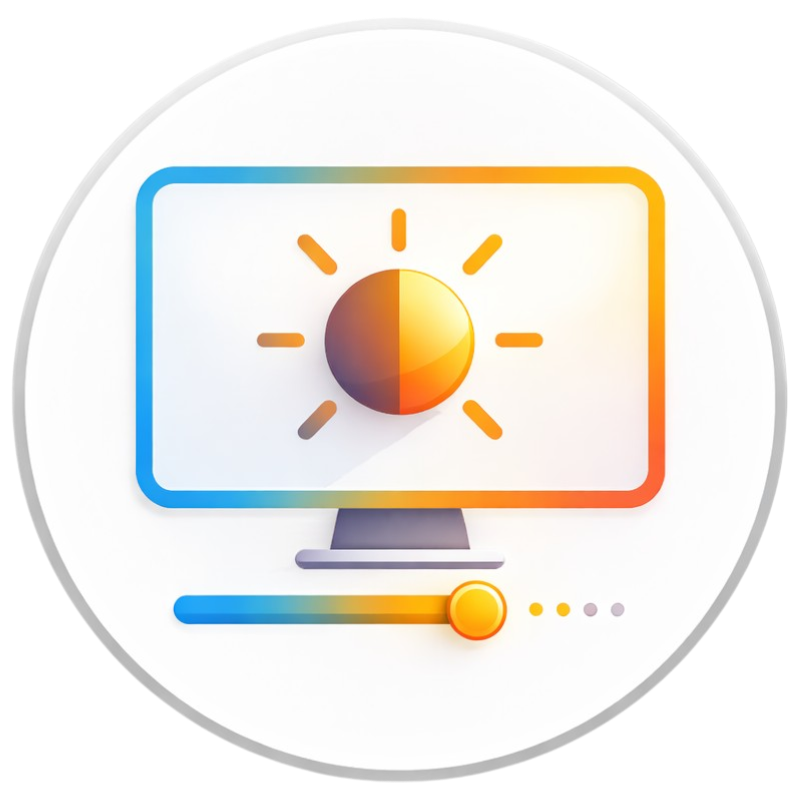

<p align="center">
  
</p>

# Brightness Slider For Desktop

A lightweight brightness controller for **Windows desktop systems** that allows you to adjust monitor brightness directly from the **taskbar tray** using **DDC/CI**.

The goal of this project is simple: provide an easy way to control brightness on desktop monitors **without adding unnecessary CPU or RAM load** to the system.

Unlike many similar applications that run multiple background processes, this tool is designed to run as a **single lightweight process** while still offering a responsive and modern user interface.

---

# Features

- Taskbar tray brightness control
- DDC/CI monitor brightness adjustment
- Multi-monitor support
- Theme-aware dynamic UI
- Windows light / dark mode support
- Accent color adaptive interface
- Lightweight single-process architecture
- Portable usage (no installer required)

---

# Why this application?

Many brightness control tools for desktop monitors are either:

- heavy and resource intensive
- visually outdated
- complicated to use
- lacking proper multi-monitor support

**Brightness Slider For Desktop** was created to solve these issues.

It provides:

- a minimal and responsive UI
- real-time brightness adjustment
- a popup interface similar to the **native laptop brightness menu**
- automatic theme adaptation based on Windows settings

---

# Screenshots

### Theme accent adaptive appearance


### Dark mode adaptive appearance


### Light mode adaptive appearance


---

# How it works

The application communicates with monitors using **DDC/CI** through the `screen_brightness_control` library.

When the tray popup is opened:

1. The application scans for compatible monitors
2. Each supported monitor receives its own brightness slider
3. Adjustments are applied instantly
4. The UI adapts automatically to Windows theme settings

---

# Building from Source

## Requirements

Install the required Python packages:

```
pip install PySide6 screen_brightness_control pyinstaller
```

---

## Build Command

Run the following command inside the project folder:

```
py -m PyInstaller --noconsole --onedir --icon=LOGO.ico --add-data "ICON.ico;." --add-data "ICONLIGHTMODE.ico;." --name BrightnessSliderForDesktop BrightnessSliderForDesktop.py
```

---

# Build Output

After the build process finishes the executable will be located in:

```
dist/BrightnessSliderForDesktop/
```

The application is **portable** and does not require installation.

---

# Usage

1. Run the executable.
2. Find the tray icon in the Windows taskbar.
3. Left-click the icon to open the brightness popup.
4. Adjust brightness using the sliders.
5. Right-click the tray icon for additional options such as:
   - Refresh Displays
   - Night Light Settings
   - Launch at Startup
   - Exit

---

# Technical Notes

### DDC/CI Support
Your monitor must support **DDC/CI** and it must be enabled in the monitor settings.

### Multi-Monitor Support
The application automatically detects all supported monitors and creates a brightness slider for each display.

### Theme-Aware Interface
The UI dynamically adapts to:

- Windows light mode
- Windows dark mode
- Windows accent color

---

# License

MIT License
